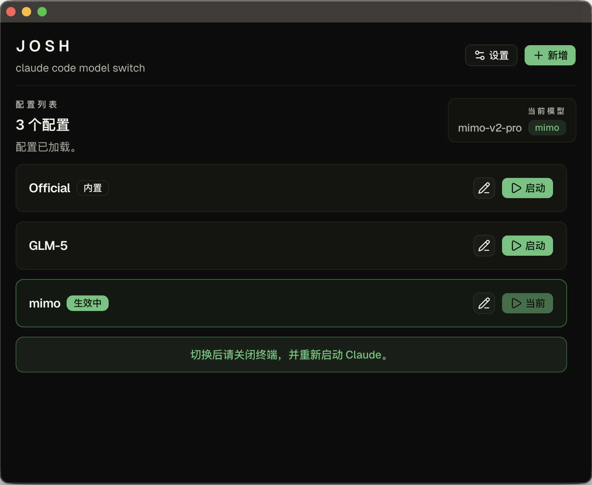

# JOSH

[中文说明](./README.zh-CN.md)

JOSH is a small desktop switcher for Claude Code model presets. It manages reusable `env` presets and writes only the `env` object in `~/.claude/settings.json`.

## Download

- Download the matching macOS build from the Releases page:
  - `arm64` for Apple Silicon Macs
  - `x64` for Intel Macs
- Open JOSH and choose a preset
- If JOSH says Claude Code is not installed, install Claude Code and launch it once first

## What It Does

- Save model presets as reusable JSON entries
- Switch the active Claude Code model with one click
- Keep a built-in `Official` preset so you can return to an empty `env`
- Preserve the rest of `settings.json`; only `env` is replaced
- Show an install warning when Claude Code is not installed yet
- Support both Chinese and English UI

## Storage

- Claude Code config: `~/.claude/settings.json`
- Preset store: `~/.josh/presets.json`
- Backup directory: `~/.josh/backups`

JOSH automatically normalizes old built-in names such as `official json` into `Official`.

## Notes

- Switching updates only the `env` object inside `settings.json`
- If Claude Code is missing, JOSH shows an install reminder and disables switching
- After switching, close the terminal and restart Claude

## Release

- Electron Forge is configured for macOS `arm64` and `x64`, each with `zip` and `dmg`
- Run `npm run make` to generate both Apple Silicon and Intel artifacts in `release/make`
- Push a tag like `v0.1.0` to trigger GitHub Actions publishing
- If you trigger the Release workflow manually, enter a tag like `v0.1.6` in the `tag` input
- The workflow builds `arm64` on Apple Silicon runners and `x64` on Intel runners, then uploads both to one draft GitHub Release
- Builds are unsigned by default, so macOS may ask users to open the app manually
