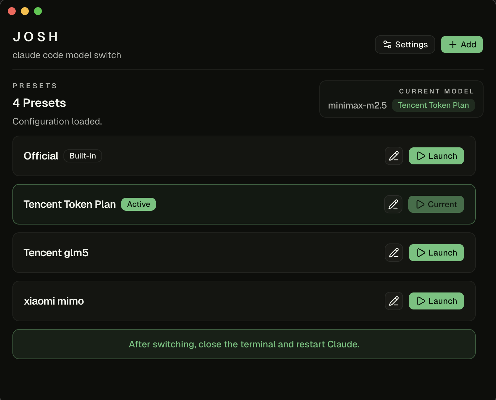

# JOSH

[English README](./README.md)

JOSH 是一个给 Claude Code 用的小型桌面切换器，用来管理模型预设，并且只改写 `~/.claude/settings.json` 里的 `env` 对象。

## 下载方式

- 从 Releases 页面下载最新的 macOS 安装包
- 打开 JOSH，选择想要启用的预设
- 如果界面提示没有安装 Claude Code，请先安装并启动一次 Claude Code

## 它能做什么

- 把常用模型配置保存成可复用的 JSON 预设
- 一键切换当前使用的 Claude Code 模型
- 内置 `Official` 预设，随时回到空 `env`
- 保留 `settings.json` 其他内容不变，只替换 `env`
- 本地没装 Claude Code 时，界面会直接提示先安装
- 支持中英文界面切换

## 存储位置

- Claude Code 配置：`~/.claude/settings.json`
- 预设文件：`~/.josh/presets.json`
- 备份目录：`~/.josh/backups`

JOSH 会自动把旧的内置名字，比如 `official json`，归一成 `Official`。

## 使用说明

- 切换时只会更新 `settings.json` 里的 `env`
- 如果本地没找到 Claude Code，JOSH 会提示先安装并禁用切换
- 切换完成后，请关闭终端并重新启动 Claude

## 发布

- 现在已经接入 Electron Forge，生成 macOS 的 `zip` 和 `dmg`
- 本地执行 `npm run make`，产物会出现在 `release/make`
- 推送像 `v0.1.0` 这样的 tag，就会触发 GitHub Actions 发布
- 工作流会把产物上传到 GitHub Draft Release
- 现在默认还是未签名包，macOS 可能会提示手动放行一次
